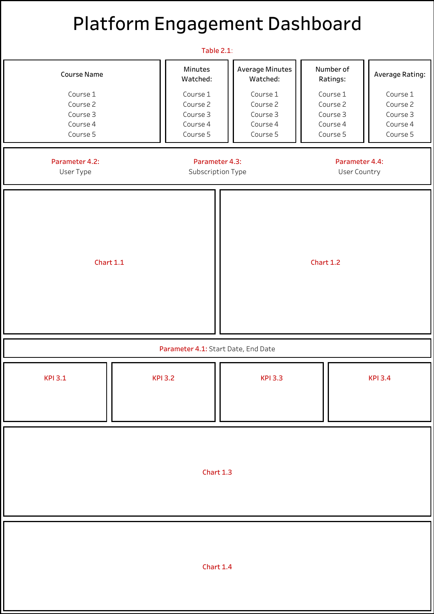
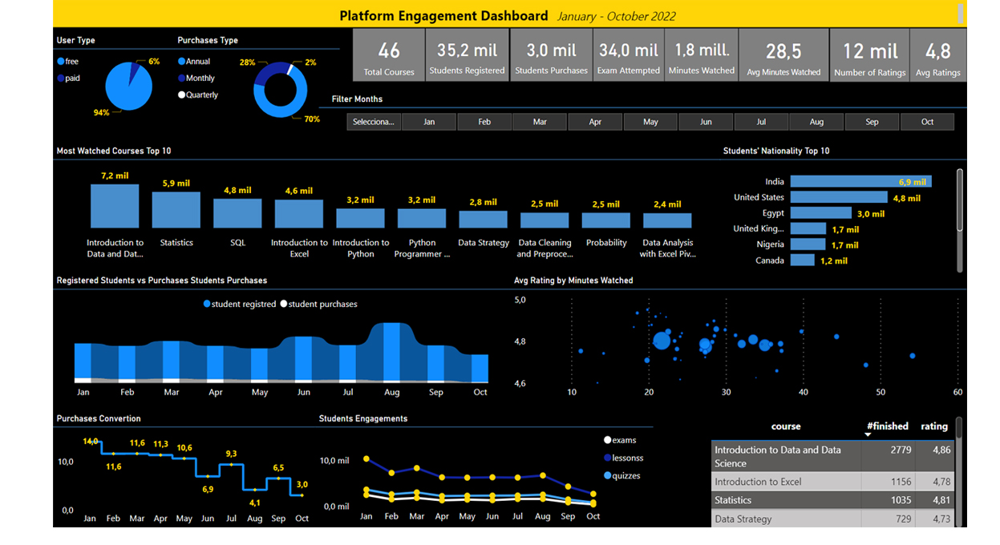

# <h1> Pj_07-000 Desarrollo de Dasboard para visualizar el engagement  de cursos virtuales de Data Science publicados en la web de 365 Data Science en el año 2022 </h1> 

*El presente proyecto es el reto propuesto por [365 DataScience](https://365datascience.com/) en 2022. Busca analizar el engagement existente entre los usuarios de esta plataforma de E-learning a través de un dashboard en PowerBI.* 

## 1. Introducción

[365 DataScience](https://365datascience.com/) es una plataforma web que ofrece a usuarios cursos virtuales en Data Science por medio de suscripciones mensuales y anuales.   

Se analizan los datos suministrados por [365 DataScience](https://365datascience.com/),  11 datasets. La información relaciona los cursos realizados por los usuarios  el 2022. Se crea una BD relacional en MySQL para almacenar los datasets. Se desarrolla un Dashboard en Power BI que tenga las siguientes características. 

*La estructura del dashboard es un esquema guía planteado por [365 DataScience](https://365datascience.com/).* 
*El diccionario de los datos: [Data_dict](data_dict.md).*

## 2. Objetivos

- Crear una base de datos en SQL para almacenar la información de los cursos.
- Generar 3 KPIs.
- Desarrollar un dashboard para a través de la visualización de los datos validar insighs.  

## 3. Recursos implementados

Python 3.9, PyMySQL 
MySQL Workbench. 
Microsoft PowerBi. 

## 4. Resultados

### 4.1 Base de datos

Se generan dos scripts para crear una base de datos relacional con los 11 datasets suministrados por [365 Data Science](https://365datascience.com/). 

*[**Python Script**](/DB/createBD.py)  
*[**SQL Script**](/DB/createDB.sql)

*Los datasets pueden ser consultados en: [datasets](/data).* 
*El modelo de entidad-relación de la base de datos puede ser consultado en: [Modelo ER](/DB/ER-BD.png).*

### 4.2 Dashboard

*Se puede consultar el dashboard realizado en: [Dashboard](https://app.powerbi.com/view?r=eyJrIjoiZDhjMTEwOTQtYmNlZS00MDFhLWFlMjItMzkxNzNlYzE4ODQwIiwidCI6ImRmODY3OWNkLWE4MGUtNDVkOC05OWFjLWM4M2VkN2ZmOTVhMCJ9)*

El dashboard presenta métricas de la plataforma como *(Cantidad de cursos, Estudiantes registrados, Compras de membresía, ratings de los cursos..)* entre otros.

**KPIs**

- Purchase Convertion : Establece la eficacia de la  plataforma  en generar que estudiantes registrados se suscriban a los planes de membresía a lo largo del tiempo. 
- Avg Rating by min Watched: Promedio de las calificaciones de los estudiantes para los cursos, teniendo en cuenta la duración en minutos de cada curso.
- user ptc Change: % de cambio respecto al mes anterior de cantidad de estudiantes registrados y cantidad de estudiantes que realizaron una suscripción .

*En el dashboard user ptc chance puede consultarse en la grafica "Registered Students vs Purchases Students Purchases"*

## 5. Conclusiones

A pesar del constante flujo de nuevos usuarios registrados en la plataforma mes a mes, la adopción de membresías por parte de los usuarios es  baja. Se recomienda explorar y desarrollar estrategias que mitigen este bajo rendimiento en la métrica y mejorar la conversión de usuarios registrados a suscriptores de membresías.